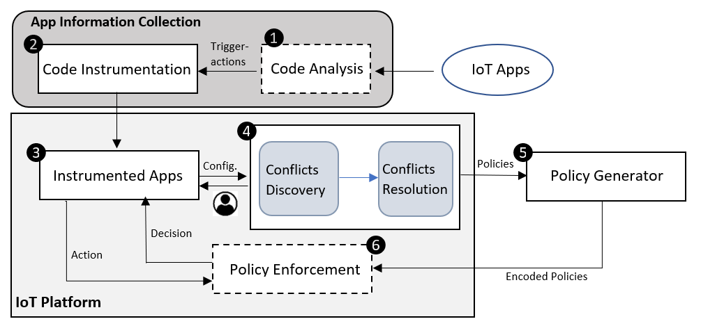

## User-in-the-loop Policy Enforcement with Cross-App Interaction Discovery in IoT Platforms

# Abstract

The Internet of Things platforms have been widely developed to better assist users in designing, controlling, and monitoring their smart home system. These platforms provide a programming interface and allow users to install various IoT apps published by third parties. As users could obtain the IoT apps from unvetted sources, a malicious app could be installed to perform unexpected behaviors that violate the user’s security and safety, such as opening the door when no motion is detected. Additionally, prior research shows that due to the lack of access control mechanisms, even benign IoT apps can cause severe security and safety risks by interacting with each other in unanticipated ways. An improved access control system is needed to detect and monitor unexpected behaviors from IoT apps to address such threats. In this thesis, we provided a system called IoTDiscover that detects single app conflicts and interaction threats between the trigger-action behavior of an IoT app. The IoTDiscover also generates resolution policies to resolve the detected conflicts by including a user-in-the-loop design. The code analysis and instrumentation will be applied to collect related information used for conflict discovery and policy enforcement, such as the actual trigger-action behavior of an app, configuration information, and runtime trigger event/action information. A policy enforcement module in the system will be encoded with policies, and it will enforce the policies at runtime by blocking actions that violate the policy. We implement and evaluate IoTDiscover with 17 official SmartApps and two malicious SmartApps on the SmartThings platform with five testing cases. As a result, IoTDiscover successfully detected all single app conflicts and interaction threats in each testing case. The resolution policies are generated and enforced effectively by blocking all violated actions.

